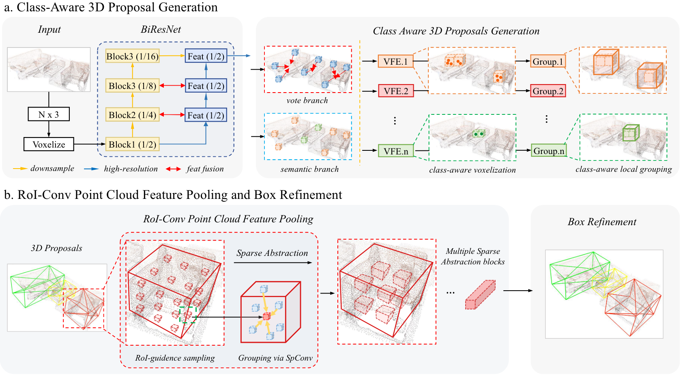

[](https://paperswithcode.com/sota/3d-object-detection-on-scannetv2?p=cagroup3d-class-aware-grouping-for-3d-object)
[](https://paperswithcode.com/sota/3d-object-detection-on-sun-rgbd-val?p=cagroup3d-class-aware-grouping-for-3d-object)

# CAGroup3D

This repo is the official implementation of the paper:
#### CAGroup3D: Class-Aware Grouping for 3D Object Detection on Point Clouds
[PaperLink](https://arxiv.org/abs/2210.04264)



## NEWS
- Official implementation based on [OpenPCDet](https://github.com/open-mmlab/OpenPCDet) is released.
- 🔥 CAGroup3D is accepted at NeurIPS 2022.

## Introduction
This paper presents a novel two-stage fully sparse convolutional 3D object detection framework, named CAGroup3D. The proposed method first generates some high-quality 3D proposals by leveraging the class-aware local group strategy on the object surface voxels with the same semantic predictions, which considers semantic consistency and diverse locality abandoned in previous bottom-up approaches. Then, to recover the features of missed voxels due to incorrect voxel-wise segmentation, we build a fully sparse convolutional RoI pooling module to directly aggregate fine-grained spatial information from backbone for further proposal refinement.
## Requirements
The code is tested on the following environment:

- Unbuntu 18.04
- Python 3.7
- Pytorch 1.10
- CUDA 11.1
## Installation

- Clone this repo and install the `pcdet` library
```bash
git clone https://github.com/Haiyang-W/CAGroup3D.git
# install spconv
pip install spconv-cu113
cd CAGroup3D/
python setup.py develop
# if you meet some pakage not matched errors, just pip install them individually before install pcdet
```

- Compile additional CUDA ops
```bash
# rotate iou ops
cd CAGroup3D/pcdet/ops/rotated_iou/cuda_op
python setup.py install
# knn ops
cd ../../knn
python setup.py develop
```

- Install [MinkowskiEngine](https://github.com/NVIDIA/MinkowskiEngine)
```bash
apt-get install -y python3-dev libopenblas-dev
pip install ninja==1.10.2.3
pip install \
  -U git+https://github.com/NVIDIA/MinkowskiEngine@v0.5.4 \
  --install-option="--blas=openblas" \
  --install-option="--force_cuda" \
  -v \
  --no-deps
# Or if you can not install MinkowskiEngine with pip sucessfully,
git clone https://github.com/NVIDIA/MinkowskiEngine.git
cd MinkowskiEngine
python setup.py install --blas=openblas --force_cuda
```

## Data preparation
We haven't achieved compatibility with the generated data of OpenPCDet yet and use the same data format as [MMdeteciton3d](https://github.com/open-mmlab/mmdetection3d) for now. We will try to implement indoor data pre-processing based on OpenPCDet as soon as possible.
- follow  [MMdetection3D(0.15)](https://github.com/open-mmlab/mmdetection3d) to create data (ScanNetV2, SunRGBD). Note that the coordinate system adopted in MMdetection3D(0.15) is very different from MMdetection3D(>=1.0). We also provide processed data in [GoogleDrive](https://drive.google.com/drive/folders/1sKvq4WBSEb4CWMdCTN6lCHLXnn3NwUv_) (highly recommended). For people from mainland China, we also provide [BaiduDrive](https://pan.baidu.com/s/1SO1YhvC9BZh5eFXYjt-a3g?pwd=8mfk).


- remember to modify the `DATA_PATH` in **tools/cfgs/dataset_configs/scannet_dataset.yaml**, **sunrgbd_dataset.yaml** or link the generated data as follows:
```shell
ln -s ${mmdet3d_scannet_dir} ./CAGroup3D/data/scannet
ln -s ${mmdet3d_sunrgbd_dir} ./CAGroup3D/data/sunrgbd
``` 

## Get started
### ScanNetV2
- Training, `num_gpus` x `batch_size` can be set to 2x8 or 4x4.
```bash
cd tools/
CUDA_VISIBLE_DEVICES={} ./scripts/dist_train.sh {num_gpus} --cfg_file cfgs/scannet_models/CAGroup3D.yaml --ckpt_save_interval 1 --extra_tag {your name} --fix_random_seed
```

- Testing
```bash
cd tools/
# test single pth
python test.py --cfg_file cfgs/scannet_models/CAGroup3D.yaml --ckpt {your pth}
# or test all checkpoints
python test.py --cfg_file cfgs/scannet_models/CAGroup3D.yaml --extra_tag {your name} --eval_all
# dist test is also supported
CUDA_VISIBLE_DEVICES={} ./scripts/dist_test.sh {num_gpus} --cfg_file cfgs/scannet_models/CAGroup3D.yaml --ckpt {your pth}
```
### Sun RGB-D
- Training, `num_gpus` x `batch_size` can be set to 2x8 or 4x4.
```bash
cd tools/
CUDA_VISIBLE_DEVICES={} ./scripts/dist_train.sh {num_gpus} --cfg_file cfgs/sunrgbd_models/CAGroup3D.yaml --ckpt_save_interval 1 --extra_tag {your name} --fix_random_seed
```

- Testing
```bash
cd tools/
# test single pth
python test.py --cfg_file cfgs/sunrgbd_models/CAGroup3D.yaml --ckpt {your pth}
# or test all checkpoints
python test.py --cfg_file cfgs/sunrgbd_models/CAGroup3D.yaml --extra_tag {your name} --eval_all
# dist test is also supported
CUDA_VISIBLE_DEVICES={} ./scripts/dist_test.sh {num_gpus} --cfg_file cfgs/sunrgbd_models/CAGroup3D.yaml --ckpt {your pth}
```

### Main Results
We reproduce CAGroup3D based on [OpenPCDet](https://github.com/open-mmlab/OpenPCDet)(Paper reported is MMDet3D version). All models are trained with 4 3090 GPUs. The batch size of each card is 4 (2x8 is better). Please note that the pcdet version of scannet pretrained model has a higher mAP@50 (61.1 vs 60.3), but a lower mAP@25 (74.0 vs 74.5) than the original paper. Additionally, the sunrgbd pretrained model has a higher mAP@25 (67.1 vs 66.4) than the original paper. Since these two datasets fluctuate significantly, training more times should yield better results than the pre-trained models we provide.

|   Dataset | mAP@0.25 | mAP0.50 | mAP@0.25(repro) | mAP0.50(repro) | Pretrain Model && Log |
|----------|----------:|:-------:|:-------:|:-------:|:-------:|
| [ScanNet](tools/cfgs/scannet_models/CAGroup3D.yaml) | 74.5  |	60.3 | 74.0 | 61.1 | [model](https://drive.google.com/drive/folders/1lhd3kx-G-6vMVj51Ryjp20cibwOD1txq), [log](https://drive.google.com/drive/folders/1lhd3kx-G-6vMVj51Ryjp20cibwOD1txq) |
| [Sun RGB-D](tools/cfgs/sunrgbd_models/CAGroup3D.yaml) | 66.4   |	49.5 | 67.1| 49.1| [model](https://drive.google.com/drive/folders/1mSmAxzHxEvXLd3IpxBsycdx9aigl7Wb3), [log](https://drive.google.com/drive/folders/1mSmAxzHxEvXLd3IpxBsycdx9aigl7Wb3) |

## Citation
Please consider citing our work as follows if it is helpful.
```
@inproceedings{
wang2022cagroupd,
title={{CAG}roup3D: Class-Aware Grouping for 3D Object Detection on Point Clouds},
author={Haiyang Wang and Lihe Ding and Shaocong Dong and Shaoshuai Shi and Aoxue Li and Jianan Li and Zhenguo Li and Liwei Wang},
booktitle={Advances in Neural Information Processing Systems},
editor={Alice H. Oh and Alekh Agarwal and Danielle Belgrave and Kyunghyun Cho},
year={2022},
url={https://openreview.net/forum?id=nLKkHwYP4Au}
}
```

## TODO

- [x] Implement CAGroup3D on OpenPCDet
- [ ] clean up and release the code of MMdetection3D version CAGroup3D
- [ ] add score refinement in the RoI-Conv Module

## Acknowledgments
This project is based on the following codebases.
* [OpenPCDet](https://github.com/open-mmlab/OpenPCDet)
* [FCAF3D](https://github.com/SamsungLabs/fcaf3d)
* [RBGNet](https://github.com/Haiyang-W/RBGNet)
